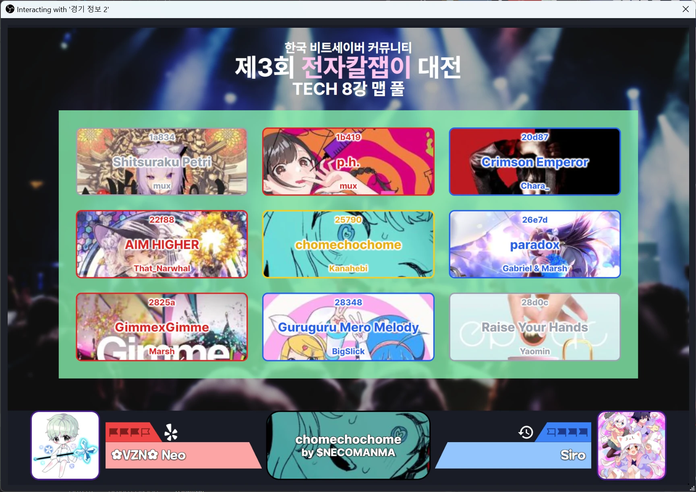

# 전자칼잽이 대전 맵 풀 화면

## 설치

이사만루체, 메이플스토리 폰트가 필요합니다.

## 사용법

브라우저 소스를 선택 또는 우클릭하면 상호작용 버튼이 있습니다. 클릭합시다.

하단 중앙 카드를 클릭하면 플레이 리스트를 불러올 수 있습니다.

맵 카드 왼쪽 위를 누르면 초기 상태가 됩니다.

맵 카드 오른쪽 위를 누르면 밴 상태로 됩니다.

맵 카드를 우클릭하면 맵이 선택됩니다.

맵 카드 왼쪽 아래를 누르면 플레이어 1이 승리한 상태가 됩니다.

맵 카드 오른쪽 아래를 누르면 플레이어 2가 승리한 상태가 됩니다.

프로필 사진을 클릭하면 슼세 ID를 입력하는 창이 뜹니다.

리트라이 아이콘을 클릭하면 소모 상태가 바뀝니다.

플레이어를 전부 설정하고 하단 중앙 카드를 우클릭하면 TA 서버를 지정할 수 있습니다.

## 주의사항

상호작용도 안 되고 아예 화면이 안 뜨는 경우가 있습니다.
OBS가 띄운 슼세 ID 입력창이 어디 가려져 있진 않은지 확인하고 닫아주세요.
